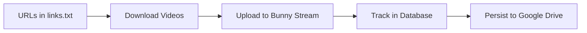

# 🎥 Video Scraper Pipeline - Google Colab Quick Start

Run the complete video ingestion pipeline on Google Colab with Bunny Stream integration.

---

## 🚀 Quick Start (5 Minutes)

### 1️⃣ Open Notebook in Colab

Or manually:
1. Go to https://colab.research.google.com
2. Upload `video_scraper_colab.ipynb`

### 2️⃣ Add Bunny Stream Credentials

1. Click **🔑 key icon** (left sidebar)
2. Add secrets:
   - `BUNNY_API_KEY` → Get from https://panel.bunny.net/account
   - `BUNNY_LIBRARY_ID` → Get from https://panel.bunny.net/stream
3. **Enable "Notebook access"** toggle

### 3️⃣ Run All Cells

1. Click **Runtime → Run all**
2. Authorize Google Drive when prompted
3. Upload `video_engine.zip` (compress the `video_engine` folder)
4. Upload or create `links.txt` with video URLs

### 4️⃣ Monitor Progress

Check the database status and logs in the final cells.

---

## 📁 What You Need

### Required Files
- `video_engine/` folder (compress as ZIP for upload)
- `links.txt` (list of video URLs, one per line)

### Required Credentials
- Bunny Stream API Key
- Bunny Stream Library ID

---

## 🎯 What It Does

1. **Harvests** video URLs from websites (optional)
2. **Downloads** videos using yt-dlp + browser extraction
3. **Uploads** to Bunny Stream CDN
4. **Tracks** status in SQLite database (saved to Google Drive)

---

## 📊 Features

✅ **Cloudflare bypass** - Playwright browser extraction  
✅ **Colab optimized** - Auto-reduces workers for RAM limits  
✅ **Persistent storage** - Database saved to Google Drive  
✅ **Resume support** - Continues after session timeout  
✅ **Auto-cleanup** - Deletes temp files after upload  
✅ **Detailed logging** - All events logged to Drive  

---

## 🆘 Troubleshooting

| Problem | Solution |
|---------|----------|
| "Failed to load secrets" | Add `BUNNY_API_KEY` and `BUNNY_LIBRARY_ID` in 🔑 secrets |
| Out of memory | Reduce `MAX_WORKERS` to 1 in Step 2 |
| Session timeout | Database persists in Drive - just reconnect and re-run |
| Browser crashes | Re-run `!playwright install chromium` |

**Full guide:** See [`COLAB_SETUP.md`](COLAB_SETUP.md)

---

## 📚 Documentation

- **[COLAB_SETUP.md](COLAB_SETUP.md)** - Complete setup guide with troubleshooting
- **[PROJECT_SUMMARY.md](video_engine/PROJECT_SUMMARY.md)** - Architecture overview
- **[QUICKSTART.md](video_engine/QUICKSTART.md)** - Local development guide

---

## 💡 Tips

- **Start small**: Test with 2-3 URLs first
- **Monitor RAM**: Check `!free -h` if browser crashes
- **Use sitemap**: Faster than generic crawling for harvesting
- **Colab Pro**: Get 2x RAM (25GB) for large batches

---

## 🔗 Resources

- [Bunny Stream Dashboard](https://panel.bunny.net/stream)
- [yt-dlp Documentation](https://github.com/yt-dlp/yt-dlp)
- [Colab FAQ](https://research.google.com/colaboratory/faq.html)

---

**Need help?** Check [`COLAB_SETUP.md`](COLAB_SETUP.md) for detailed troubleshooting.
