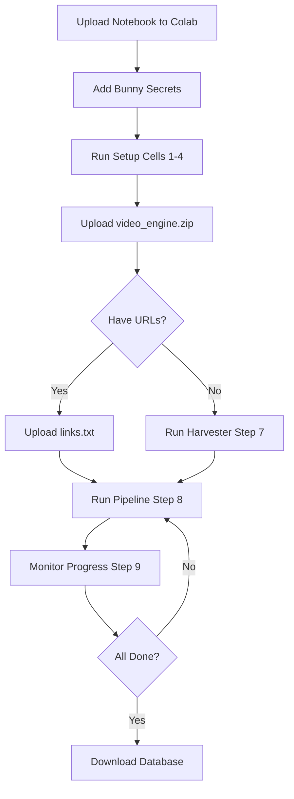

# 🚀 Google Colab Setup Guide

Complete guide to run the video scraper pipeline on Google Colab.

---

## 📋 Prerequisites

### 1. Bunny Stream Account
- Sign up at https://bunny.net
- Get your **API Key**: https://panel.bunny.net/account
- Get your **Library ID**: https://panel.bunny.net/stream

### 2. Google Account
- Google Colab (free tier works)
- Google Drive (for database persistence)

---

## 🎯 Quick Start

### Step 1: Upload Notebook to Colab

1. Go to https://colab.research.google.com
2. Click **File → Upload notebook**
3. Upload `video_scraper_colab.ipynb`

### Step 2: Add Bunny Stream Credentials

1. Click the **🔑 key icon** in the left sidebar
2. Add two secrets:
   - Name: `BUNNY_API_KEY` → Value: `your_api_key_here`
   - Name: `BUNNY_LIBRARY_ID` → Value: `your_library_id_here`
3. **Enable "Notebook access"** toggle for both secrets

### Step 3: Prepare Project Files

**Option A: Upload as ZIP**
```bash
# On your local machine
cd c:\DataScience_AI_folder\Portfolio\web_scrapper
# Compress the video_engine folder into video_engine.zip
```

**Option B: Clone from GitHub** (if you've pushed to GitHub)
```python
# In Colab cell
!git clone https://github.com/yourusername/video-scraper.git
!mv video-scraper/video_engine /content/video_engine
```

### Step 4: Run All Cells

1. Click **Runtime → Run all**
2. Authorize Google Drive access when prompted
3. Upload `video_engine.zip` when prompted (Step 5)
4. Upload or create `links.txt` (Step 6)

---

## 📁 File Structure in Colab

```
/content/
├── video_engine/              # Your project files
│   ├── config.py
│   ├── database.py
│   ├── harvester.py
│   ├── main.py
│   ├── core/
│   ├── extractors/
│   └── temp_storage/
│
/content/drive/MyDrive/video_engine_data/  # Persistent storage
├── video_tracker.db           # SQLite database (persists across sessions)
└── pipeline.log               # Execution logs
```

---

## ⚙️ Configuration

### Environment Variables (Auto-configured in notebook)

| Variable | Value | Description |
|----------|-------|-------------|
| `BUNNY_API_KEY` | From Colab secrets | Bunny Stream API key |
| `BUNNY_LIBRARY_ID` | From Colab secrets | Bunny Stream library ID |
| `USE_BROWSER` | `true` | Enable browser extraction for protected sites |
| `MAX_WORKERS` | `2` | Concurrent workers (auto-limited for Colab RAM) |

### Colab-Specific Optimizations

✅ **Already implemented in `config.py`:**
- Auto-detects Colab environment (`/content/drive/MyDrive`)
- Saves database to Google Drive for persistence
- Reduces MAX_WORKERS to 2 when browser is enabled
- Uses headless browser mode

---

## 🔍 Usage Examples

### Example 1: Process URLs from links.txt

```python
# In Step 6: Create links.txt
links_content = """
https://example.com/video1
https://example.com/video2
https://example.com/video3
"""

# Run Step 8: Pipeline will process all URLs
```

### Example 2: Auto-discover URLs from website

```python
# In Step 7: Configure harvester
WEBSITE_URL = "https://viralkand.com"
METHOD = "sitemap"  # Try sitemap first
MAX_PAGES = 50

# Harvester will find all video URLs automatically
```

### Example 3: Resume after session timeout

```python
# Colab sessions timeout after 12 hours
# Your database is saved to Google Drive, so just:
# 1. Reconnect to runtime
# 2. Run all cells again
# 3. Pipeline will skip already UPLOADED videos
```

---

## 🆘 Troubleshooting

### ❌ "Failed to load secrets"

**Problem:** Bunny Stream credentials not found

**Solution:**
1. Click 🔑 icon in left sidebar
2. Add `BUNNY_API_KEY` and `BUNNY_LIBRARY_ID`
3. **Enable "Notebook access" toggle**
4. Re-run Step 2

---

### ❌ "Out of Memory" / Browser crashes

**Problem:** Colab free tier has ~12GB RAM, browser uses 400-600MB per instance

**Solutions:**
```python
# Option 1: Reduce workers to 1
os.environ['MAX_WORKERS'] = '1'

# Option 2: Disable browser (only works for non-protected sites)
os.environ['USE_BROWSER'] = 'false'

# Option 3: Restart runtime
# Runtime → Restart runtime
```

---

### ❌ "Session disconnected" / Timeout

**Problem:** Colab free tier disconnects after:
- 12 hours idle
- 24 hours maximum runtime

**Solutions:**
1. **Database persists in Google Drive** - just reconnect and re-run
2. Upgrade to **Colab Pro** for longer sessions
3. Use **auto-clicker** to prevent idle timeout (not recommended)

---

### ❌ "Playwright browser not found"

**Problem:** Chromium not installed

**Solution:**
```bash
# Re-run Step 4
!playwright install chromium
```

---

### ❌ "video_engine folder not found"

**Problem:** ZIP extraction failed

**Solution:**
```bash
# Make sure your ZIP structure is:
# video_engine.zip
#   └── video_engine/
#       ├── config.py
#       ├── database.py
#       └── ...

# NOT:
# video_engine.zip
#   ├── config.py  ❌ (files at root level)
#   └── ...
```

---

### ❌ "Disk space full"

**Problem:** Colab has ~100GB disk, large videos fill it up

**Solutions:**
```python
# Check disk space
!df -h /content

# Clear temp storage
!rm -rf /content/video_engine/temp_storage/*

# Videos are deleted after upload, but check for stuck files
```

---

## 📊 Monitoring

### Check Pipeline Status

```python
# Run Step 9: Monitor Progress
from database import VideoDatabase
db = VideoDatabase()

# Get counts
stats = db.get_status_counts()
print(stats)
# Output: {'PENDING': 10, 'DOWNLOADED': 3, 'UPLOADED': 5, 'FAILED': 2}
```

### View Logs

```python
# View last 50 lines
!tail -n 50 /content/drive/MyDrive/video_engine_data/pipeline.log

# View errors only
!grep ERROR /content/drive/MyDrive/video_engine_data/pipeline.log
```

### Download Database

```python
# Download for local inspection with DB Browser for SQLite
from google.colab import files
files.download('/content/drive/MyDrive/video_engine_data/video_tracker.db')
```

---

## 🎯 Best Practices

### 1. Start Small
```python
# Test with 2-3 URLs first
links_content = """
https://example.com/test-video-1
https://example.com/test-video-2
"""
```

### 2. Monitor RAM Usage
```python
# Check memory
!free -h

# If RAM > 10GB, reduce workers
os.environ['MAX_WORKERS'] = '1'
```

### 3. Use Sitemap for Harvesting
```python
# Sitemap is faster and more reliable than generic crawling
METHOD = "sitemap"  # Preferred
# METHOD = "generic"  # Fallback
```

### 4. Handle Failures
```python
# Check failed URLs
from database import VideoDatabase
db = VideoDatabase()
failed = db.get_urls_by_status('FAILED')

# Retry failed URLs
for url_id, url in failed:
    db.update_status(url_id, 'PENDING')  # Reset to PENDING
```

---

## 🔄 Workflow



---

## 📚 Additional Resources

- **Bunny Stream Dashboard**: https://panel.bunny.net/stream
- **yt-dlp Documentation**: https://github.com/yt-dlp/yt-dlp
- **Playwright Docs**: https://playwright.dev/python/
- **Colab FAQ**: https://research.google.com/colaboratory/faq.html

---

## 💡 Tips

1. **Colab Pro** ($10/month) gives:
   - 2x RAM (25GB)
   - Longer runtimes (24h+ idle)
   - Faster GPUs (not needed for this project)

2. **Background execution**:
   - Colab doesn't support true background jobs
   - Keep browser tab open to prevent disconnection

3. **Cost optimization**:
   - Free tier is sufficient for small batches (<100 videos)
   - For large-scale scraping, consider dedicated VPS

4. **Security**:
   - Never commit Colab secrets to GitHub
   - Use Colab's built-in secrets manager (🔑 icon)

---

## 🐛 Known Issues

### Issue 1: Cloudflare challenges
**Symptom:** "Browser extraction failed" for some sites

**Workaround:**
- Playwright-stealth helps but isn't 100% effective
- Some sites may require manual CAPTCHA solving
- Consider using residential proxies for production

### Issue 2: yt-dlp format selection
**Symptom:** Downloads wrong quality or format

**Fix:** Edit `extractors/ytdlp_extractor.py`:
```python
ydl_opts = {
    'format': 'bestvideo[ext=mp4]+bestaudio[ext=m4a]/best[ext=mp4]/best',
    # Add more specific format filters
}
```

---

**Need help?** Open an issue on GitHub or contact support.
